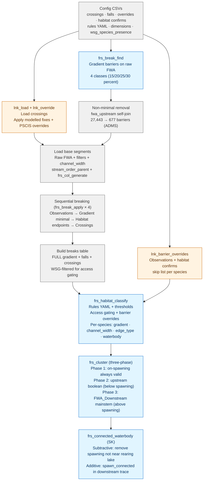

# bcfishpass Comparison

fresh 0.13.8 + link vs bcfishpass (tunnel v0.7.12+, CSVs synced @ ea3c5d8).

## Results (2026-04-15)

All species within 5% on all 4 WSGs. Three-phase cluster, no stream order bypass.

### ADMS

| Species | Spawning | Rearing |
|---------|----------|---------|
| BT | +1.8% | -0.7% |
| CH | +0.5% | +2.5% |
| CO | +1.6% | +0.1% |
| SK | +3.7% | +0.0% |

### BULK

| Species | Spawning | Rearing |
|---------|----------|---------|
| BT | +3.1% | -2.2% |
| CH | +1.9% | +2.6% |
| CO | +3.1% | +0.4% |
| PK | +2.3% | N/A |
| SK | -0.7% | +0.0% |
| ST | +1.9% | -0.1% |

### BABL

| Species | Spawning | Rearing |
|---------|----------|---------|
| BT | +4.1% | -0.6% |
| CH | +3.8% | +3.6% |
| CO | +4.8% | +1.6% |
| SK | -2.8% | +0.0% |
| ST | +3.8% | +1.9% |

### ELKR

| Species | Spawning | Rearing |
|---------|----------|---------|
| BT | +3.4% | +0.2% |
| WCT | +4.0% | +2.5% |

## DAG

Blue = `fresh` functions. Orange = `lnk_` functions. Grey = composite operations (multiple function calls bundled into one step).

## Pipeline operations

Composite steps in the DAG that aren't a single function call:

- **Non-minimal removal** — `fwa_upstream()` self-join that deletes gradient barriers which have another gradient barrier downstream. 27,443 → 677 on ADMS. Leaves only the furthest-downstream barrier per reach so the sequential breaking pass isn't redundant.
- **Load base segments** — raw FWA filtered to the AOI (`localcode_ltree IS NOT NULL`, `edge_type != 6010`, no coastlines), with `channel_width` joined from `fwa_stream_networks_channel_width` and `stream_order_parent` from `fwa_stream_networks_order_parent`. `frs_col_generate` adds GENERATED columns for gradient, measures, length.
- **Sequential breaking** — `frs_break_apply` called 4 times in order: observations → minimal gradient barriers → habitat endpoints (DRM + URM) → crossings. Each round reassigns `id_segment`, recomputes GENERATED columns; 1m guard prevents duplicate breaks.
- **Build breaks table** — reassembly of gradient barriers (FULL, not minimal) + falls + crossings, filtered to WSG. Used for access gating during classification.

## Key fixes during comparison

| Fix | Impact | Type |
|-----|--------|------|
| ST observation_species: "ST" → "CH;CM;CO;PK;SK;ST" | -22% → +3.8% | CSV cell |
| WCT observation_threshold: NA → 1 | -4.2% → +3.0% | CSV cell |
| BT cluster_rearing: FALSE → TRUE | +7% → +1.3% | CSV cell |
| SK outlet ordering: DRM → wscode | -22.6% → -0.7% | fresh code (0.13.5) |
| SK spawn_connected additive step | -9.6% → -0.7% | fresh code (0.13.6) |
| Three-phase cluster | CH +6% → +2.6% | fresh code (0.13.8) |
| Index input tables | 228s → 6.6s classification | fresh code (0.13.4) |

## Remaining gaps

### BT rearing -2.2% (BULK)

bcfishpass applies `stream_order = 1 AND stream_order_parent >= 5` as a rearing cw bypass in all three rearing phases. We don't replicate this because the bypass interacts with clustering — applying it pre-cluster inflates rearing, applying it post-cluster adds segments without connectivity constraints. The 68 km gap is the bypass segments we don't capture.

`frs_order_child` (fresh#158) will address this with a biologically-tuned approach: direct children only (`stream_order = stream_order_max`), distance cap from tributary mouth.

### Spawning +1-4% consistent positive bias

All species show +1-4% spawning excess. From segment boundary differences — our single-pass non-minimal barrier removal creates slightly different segment boundaries than bcfishpass per-model sequential breaking. Different boundaries → different per-segment gradients → different threshold pass/fail at edges.

## Break sources

All positions pre-computed. No snapping during breaking.

| Source | Origin |
|--------|--------|
| Gradient barriers | Computed from FWA vertex geometry |
| Observations | bcfishobs (species-filtered via wsg_species_presence.csv) |
| Crossings | crossings.csv in fresh (pre-computed) |
| Habitat endpoints | user_habitat_classification.csv (both DRM and URM) |
| Falls | falls.csv in fresh |

## Versions

- fresh: 0.13.8
- link: main (7f5d880)
- bcfishpass: ea3c5d8 (post-v0.7.13), tunnel model run v0.7.12
- fwapg: Docker (FWA 20240830, channel_width synced from tunnel 2026-04-13)
