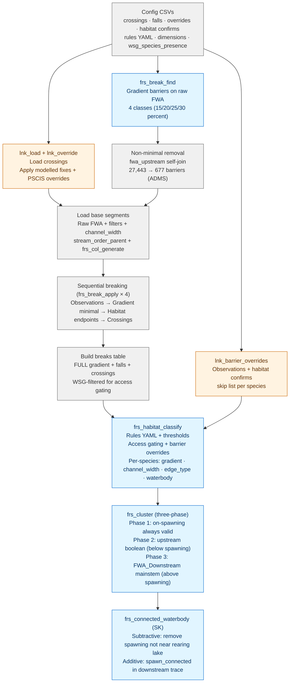
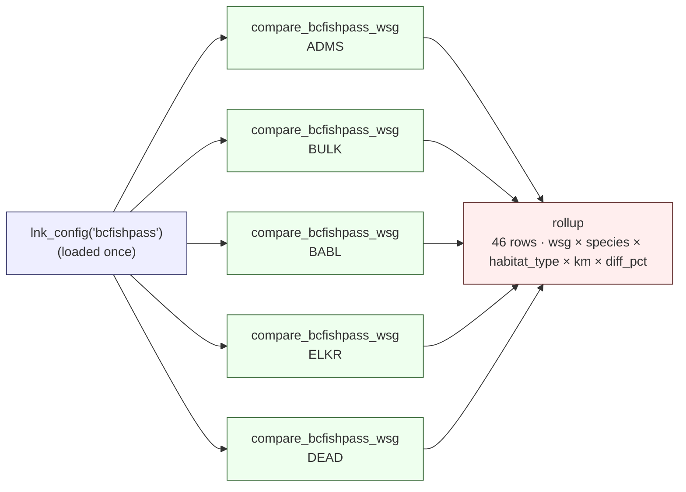

# bcfishpass Comparison

fresh 0.14.0 + link 0.4.0 vs bcfishpass (reference `habitat_linear_*` tables on tunnel, bcfishpass ea3c5d8, fwapg 20240830).

## 2026-04-29 — parity claim retracted

Earlier framing ("all species within 5%", "exact reproduction") held only on a small set of pre-selected WSGs (ADMS, BABL, BULK, ELKR, DEAD) where the missing barrier classes happened not to bite. Expanding the comparison to PARS, MORR, KISP, KOTL, NATR (`data-raw/logs/20260429_01_tar_make_10wsg.txt`) surfaced material departures — NATR BT spawning +15.2%, NATR BT rearing +13.0%, KISP SK spawning +42% — that are not methodology choices.

Root cause: link's bcfishpass-config bundle is missing barrier classes that bcfishpass's pipeline uses.

| Class | bcfishpass source | link source | Status |
|---|---|---|---|
| Subsurface flow | `whse_basemapping.fwa_stream_networks_sp` where `edge_type IN (1410, 1425)` honoured as access barrier | not modelled | gap |
| Falls | `cabd.waterfalls` + four CABD edit CSVs (`cabd_additions`, `cabd_exclusions`, `cabd_blkey_xref`, `cabd_passability_status_updates`) | `fresh::falls.csv` (static, no CABD edits) | partial |
| Dams | `cabd.dams` + same four CABD edit CSVs, `passability_status_code = 1` → barrier | not modelled | gap |
| Gradient | derived | derived (`gradient_minimal`) | OK |
| User definite | `user_barriers_definite.csv` | same | OK |

Confirmed mechanism on stream `blue_line_key = 359569193` in NATR: bcfishpass cuts BT rearing at DRM 16,466 m at a `SUBSURFACEFLOW` barrier. Link extends rearing 94 km further upstream. NATR has the highest proportional subsurface burden of any tested WSG (7.6% of `barriers_bt`); the parity WSGs sit at ≤3.8%.

Vignette pulled, README and DESCRIPTION reframed as experimental. Code work tracked in issues #N (subsurfaceflow), #N (CABD wiring) — TBD.

### Subsurfaceflow fix — 10-WSG validation

NATR BT, bcfishpass-config, with `subsurfaceflow` added to `pipeline.break_order`:

| metric | pre-fix | post-fix | bcfishpass ref |
|---|---|---|---|
| BT spawning_km | 1719 (+15.2%) | 1514 (+1.5%) | 1492 |
| BT rearing_km | 3469 (+13.0%) | 3053 (-0.6%) | 3071 |
| BT rearing_stream_km | 2830 (+13.8%) | 2458 (-1.1%) | 2486 |

Specific verification: stream `blue_line_key 359569193` cuts BT rearing at DRM 16,465.98 m post-fix (16.56 km rearing on this stream); bcfishpass cuts at DRM 16,466 (16.47 km). Match to within rounding precision.

Full 10-WSG `tar_make()` (`data-raw/logs/20260429_02_tar_make_subsurf.txt`, 40m18s) per-WSG diff_pct summary across spawning + rearing + rearing_stream:

| WSG | min | max | median | rows >5% |
|---|---|---|---|---|
| ADMS | -3.9 | +1.1 | 0.0 | 0 |
| BABL | -5.3 | +1.3 | -2.0 | 2 |
| BULK | -4.1 | +0.8 | -0.6 | 0 |
| DEAD | -1.4 | +1.0 | 0.0 | 0 |
| ELKR | -3.2 | +1.8 | -1.1 | 0 |
| KISP | -3.1 | +42.3 | +0.05 | 1 |
| KOTL | -4.0 | -0.2 | -1.9 | 0 |
| MORR | -9.3 | +1.3 | 0.0 | 4 |
| NATR | -1.1 | +1.5 | -0.6 | 0 |
| PARS | -3.1 | +0.8 | -2.1 | 0 |

Wins:
- NATR collapsed from biggest outlier (+13–15% on multiple BT rows) to median -0.6%, max abs 1.5%.
- Original parity WSGs (ADMS, BULK, BABL, ELKR, DEAD) — no meaningful regression.

Remaining outliers (7 rows >5% departure):

| wsg | species | metric | link | bcfp | diff_pct |
|---|---|---|---|---|---|
| KISP | SK | spawning | 10.2 | 7.14 | +42.3 |
| MORR | SK | spawning | 48.8 | 53.8 | -9.3 |
| MORR | ST | rearing_stream | 806 | 874 | -7.8 |
| MORR | ST | rearing | 1110 | 1176 | -5.6 |
| BABL | ST | rearing_stream | 853 | 901 | -5.3 |
| BABL | ST | rearing | 877 | 924 | -5.2 |
| MORR | CO | rearing_stream | 880 | 929 | -5.2 |

Pattern: 6 of 7 are direction `link < bcfishpass` (link under-credits) — opposite of what subsurfaceflow caused. Different mechanism. KISP SK (+42.3%) is the only over-credit but tiny absolute (3 km of stream). Concentration on MORR + ST suggests methodology dimension we haven't matched, possibly around `barriers_st`-specific gradient classes or `streams_habitat_known` overlay interactions. Investigate as a separate slice; not in subsurfaceflow's scope.

### 2026-04-30 — segment-level diff on MORR ST: phase-1 exclusion + confluence boost interaction

Traced one `link_only` segment (`blkey 360704379, DRM 1058, edge 1000, grad 0.0587, order 1, 1822 m`) in MORR ST. Both DBs show identical FWA inputs (channel_width 1.51, parent_order 2, edge_type 1000). bcfp does NOT credit; link does.

**Setup**: bcfp's path-3 cluster check on cluster 502 (containing the trib + Nado Creek segments). The trib drains into Nado Creek at the confluence; **Nado Creek DRM 3679 has gradient 0.1258 (>12%)** — a real bridge-gradient barrier between the trib confluence and downstream spawning at Nado DRM 3605 / DRM 3180 / etc.

**bcfp's path-3** correctly invalidates cluster 502:

| step | segment | gradient | role |
|---|---|---|---|
| cluster_min | Nado DRM 3687 | 0.0152 | self, excluded from trace (`fwa_downstream(self, self) = FALSE` confirmed) |
| trace rn=1 | Nado DRM 3679 | **0.1258** | first ≥5% gradient → `nearest_5pct.row_number = 1` |
| trace rn=2 | Nado DRM 3605 | 0.0137 | first spawning → `nearest_spawn.row_number = 2` |

`nearest_5pct (1) > nearest_spawn (2)` is FALSE → cluster invalidated. Replicated bcfp's path-3 SQL on production DB and confirmed `valid_rearing` returns 0 rows for cluster 502.

**fresh's `.frs_cluster_both` does have the same row_number comparison** in phase-3 (`fresh/R/frs_cluster.R:524–539`) — structurally identical to bcfp. So why does fresh credit?

**Root cause**: **Phase-1 exclusion shifts cluster_min into the confluence-boost zone**.

- Fresh's phase-1 (`frs_cluster.R:414–425`) excludes segments where both `label_cluster` and `label_connect` are TRUE on the same segment. Nado DRM 3687 has both spawning=TRUE and rearing=TRUE → excluded from clustering.
- After exclusion, the trib's 2 segments form their own sub-cluster (DBSCAN re-clusters because DRM 3687 was the spatial bridge). cluster_min = **trib DRM 0**.
- Phase-2 confluence boost (`frs_cluster.R:468–473`) activates when cluster_min DRM < `confluence_m` (default 10 m). 0 < 10 → boost fires.
- The boost calls `FWA_Upstream(subpath(trib_ws, 0, -1), trib_ws, st.wscode, st.localcode)` — looking for spawning upstream of the parent's wscode. **Finds Nado DRM 3687** (the very segment phase-1 excluded) → cluster validated via phase-2.

**bcfishpass behavior** (no phase-1 exclusion): cluster_min stays at Nado DRM 3687 (the lowest-wscode segment in cluster). DRM 3687 ≥ 10 → confluence boost doesn't fire. Path-2 strict-upstream check finds no spawning above DRM 3687 → fails. Path-3 fails on bridge gradient. Cluster correctly denied.

**Ecologically**: bcfp is right. The 5% bridge-gradient threshold is a juvenile-movement constraint, not an adult-access threshold — small fish (fry, juveniles) cannot overcome the velocities of segments steeper than ~5%. Adult ST DO reach the trib via the species access threshold (20%); the question is whether emerging fry can move between downstream spawning and the rearing-eligible reaches. With a 12.58% segment at the trib mouth, fry can't traverse to use the upstream rearing — so the trib's rearing-eligible segments aren't usable habitat. Fresh's phase-1 + confluence-boost interaction credits them incorrectly.

This pattern likely accounts for most of the 49 km MORR ST `bcfp_only` gap (and similar gaps on BABL ST). Each high-gradient confluence above downstream spawning produces the same artifact when a trib has rearing-eligible segments above it.

**Where to fix**: in fresh — `.frs_cluster_both` should not let phase-1 exclusion validate clusters that bridge_gradient would otherwise deny. Two candidate fixes:
1. Phase-1 exclusion only affects the FINAL `UPDATE` (don't strip rearing on phase-1 segments) but does NOT change cluster boundaries for phase-2/3 testing. This restores cluster_min to its pre-exclusion location.
2. Phase-2's confluence boost should also apply a bridge_gradient check on the path between cluster_min and the spawning candidate it found via the boost.

Option 1 is structurally cleaner. Option 2 is more general. Either would close the MORR ST gap.

Implementation: `.lnk_pipeline_prep_subsurfaceflow` mirrors bcfishpass's `barriers_subsurfaceflow.sql` exactly — same FWA filter, same `user_barriers_definite_control` LEFT JOIN guard. Inclusion is opt-in via `cfg$pipeline$break_order` containing `subsurfaceflow`. Bcfishpass-bundle config opts in; default-bundle does not.

## How bcfishpass classifies segments — natural vs anthropogenic tiers

bcfishpass maintains **two separate access tiers** per segment and the distinction is load-bearing for what link should be reproducing.

### Tier 1 — natural access

Per-species natural-barrier set, stored as a downstream-feature array on each segment in `bcfishpass.streams_access`:

| Column | Source barriers |
|---|---|
| `barriers_bt_dnstr` | gradient (≤25%) + falls + subsurfaceflow + user_definite (BT) |
| `barriers_ch_cm_co_pk_sk_dnstr` | gradient (≤15%) + falls + subsurfaceflow + user_definite (salmon) |
| `barriers_ct_dv_rb_dnstr` | gradient (≤25%) + falls + subsurfaceflow + user_definite (CT/DV/RB) |
| `barriers_st_dnstr` | gradient (≤20%) + falls + subsurfaceflow + user_definite (ST) |
| `barriers_wct_dnstr` | gradient + falls + subsurfaceflow + user_definite (WCT) |

Built by `model/01_access/01_model_access_natural.sh` → `model_access_<species>.sql` UNIONs the source tables and minimal-reduces.

`bcfishpass.habitat_linear_<species>` (the rule-based per-species modelled habitat — what link's parity comparison reads as the reference) gates spawning / rearing on `barriers_<species>_dnstr = array[]::text[]` — i.e. **NATURAL access only**. No dams, no PSCIS.

### Tier 2 — anthropogenic access

Built by `model/01_access/02_model_access_anthropogenic.sh`. Three overlapping classes derived from the unified `bcfishpass.crossings` table, each filtered to `barrier_status IN ('BARRIER', 'POTENTIAL') AND blue_line_key = watershed_key`:

| Class | Filter | Source CSV / table |
|---|---|---|
| `barriers_anthropogenic` | (no extra filter — all crossings that are barriers/potential) | unified crossings table |
| `barriers_dams` | `dam_id IS NOT NULL` | CABD `cabd.dams` + `cabd_*` edits |
| `barriers_dams_hydro` | `dam_id IS NOT NULL AND dam_use = 'Hydroelectricity'` | same |
| `barriers_pscis` | `stream_crossing_id IS NOT NULL` | PSCIS BC Data Catalogue + `user_pscis_barrier_status.csv` |

Per-segment downstream arrays in `streams_access`: `barriers_anthropogenic_dnstr`, `barriers_dams_dnstr`, `barriers_dams_hydro_dnstr`, `barriers_pscis_dnstr`. Plus boolean flags `dam_dnstr_ind`, `dam_hydro_dnstr_ind`, `remediated_dnstr_ind`. **These do NOT feed `habitat_linear_<sp>`.** They're consumed by crossings reports, dam-impact rollups, and the WCRP tracking layer.

### Per-species access integer code

`streams_access.access_<species>` is a single integer summarising natural-tier accessibility AND observation evidence:

| Code | Meaning |
|---|---|
| `-9` | species not present in this WSG (per `wsg_species_presence`) |
| `0` | inaccessible — natural barrier downstream |
| `1` | potentially accessible — no natural barrier downstream, no upstream observation (modelled only) |
| `2` | observed accessible — no natural barrier downstream and fish observed upstream of this segment |

`POTENTIAL` crossings are treated equivalently to `BARRIER` crossings in the anthropogenic-access calculation — but again, this does not affect `habitat_linear_<sp>`.

### Per-segment habitat status code

`streams_habitat_linear.<species>_spawning|rearing` blends the rule-based model with the known/observed overlay:

| Code | Meaning |
|---|---|
| `-1` | known non-habitat (operator says no) |
| `-4` / `-5` | special exclusion classes (release flags) |
| `0` | neither modelled nor observed |
| `1` | modelled only (rule-based, gated on natural access) |
| `2` | modelled + observed |
| `3` | observed only, not modelled |

Link's `frs_habitat_overlay` reproduces the model+observed blend. The parity comparison so far has been against `habitat_linear_<sp>` (modelled tier), not `streams_habitat_linear` (blended tier).

### Implication for the dams work

Adding dams + PSCIS to link does **not** change `habitat_linear_<sp>` parity numbers, because that table only uses natural barriers. Dams work is a new feature surface for anth-access reports + dam-impact analyses — different downstream consumers, parallel to habitat_linear, not blocking parity.

If we want a per-segment "potentially accessible to species X" integer code in link analogous to bcfishpass's `access_<sp>` (-9 / 0 / 1 / 2), that's a separate fresh-side concern — fresh's `streams_habitat` already encodes accessibility per segment in the `accessible` column, but the integer-code semantic with the observation-presence dimension is new territory.

## Dams design — much smaller than expected

Initial plan was: ingest the four CABD CSVs (`cabd_additions`, `cabd_exclusions`, `cabd_blkey_xref`, `cabd_passability_status_updates`) into link, source `cabd.dams` separately, replicate bcfishpass's `load_dams.sql`. Reading the actual bcfishpass code shows this is the wrong path.

The simpler picture:

- bcfishpass's `barriers_dams` is `SELECT … FROM bcfishpass.crossings WHERE dam_id IS NOT NULL AND barrier_status IN ('BARRIER','POTENTIAL') AND blue_line_key = watershed_key` (`model/01_access/sql/barriers_dams.sql`).
- `bcfishpass.crossings` is the unified CABD-edited table — built by bcfishpass with all four CABD edit CSVs already applied.
- `fresh::system.file("extdata", "crossings.csv")` is regenerated from `bcfishpass.crossings` via `fresh/data-raw/bcfishpass_crossings.R`. **CABD edits flow through that source automatically** — nothing for link to ingest.
- Today fresh's CSV projects only 10 columns; the columns we need (`dam_id`, `stream_crossing_id`, `dam_use`, `wscode_ltree`, `localcode_ltree`, `crossing_feature_type`) are dropped at SELECT time. They exist upstream.

Implication: the dams work splits cleanly into two patches:

1. **fresh side** — expand the `SELECT` in `data-raw/bcfishpass_crossings.R` to include `dam_id`, `stream_crossing_id`, `crossing_feature_type`, `dam_use`, `wscode_ltree`, `localcode_ltree`. Regenerate `inst/extdata/crossings.csv`. One-line SELECT change + a regenerate run.
2. **link side** — once fresh ships the expanded CSV, add `barriers_dams` (and optionally `barriers_pscis` / `barriers_anthropogenic`) as opt-in break sources following the same pattern just landed for subsurfaceflow:
   - `.lnk_pipeline_prep_dams(conn, schema)` materializes `<schema>.barriers_dams` from `<schema>.crossings WHERE dam_id IS NOT NULL AND barrier_status IN ('BARRIER','POTENTIAL') AND blue_line_key = watershed_key`.
   - `source_tables[["dams"]] <- paste0(schema, ".barriers_dams")` in `lnk_pipeline_break.R`.
   - Conditional UNION ALL in `lnk_pipeline_classify_build_breaks` (label `'blocked'`).
   - `dams` added to `pipeline.break_order` in any config that opts in.

**Reminder of the tier distinction**: dams are anthropogenic — adding them to a config does NOT change `habitat_linear_<sp>` parity numbers (those are natural-tier only). Dams add a new analytical layer for "what's blocked by dams downstream" reports, dam-impact rollups, and any custom config that wants dam-aware accessibility. The bcfishpass-bundle config should NOT add `dams` to break_order, because doing so would diverge from `habitat_linear_<sp>`'s natural-only access semantic.

## Correctness bar (historical, retracted)

**Bit-identical output from the same inputs.** Three consecutive `tar_make()` runs on 2026-04-22 produced the exact same 34-row rollup tibble (`data-raw/logs/20260422_{10,11,12}_*.txt`). Parity to bcfishpass (the `diff_pct` column in the rollup) was framed as an informational diagnostic. The 2026-04-29 expansion shows the rollup-level diff_pct is in fact reading real defects, not just methodology. Treat the section below as historical, not as current state.

## Results (2026-04-22, rollup from `tar_make()`)

All species within 5% of bcfishpass reference. Pipeline runs serially in ~8.5 min wall clock.

### ADMS

| Species | Spawning | Rearing |
|---------|----------|---------|
| BT | +1.8% | -1.1% |
| CH | +0.5% | +2.3% |
| CO | +1.6% | -0.1% |
| SK | +3.7% | +0.0% |

### BULK

| Species | Spawning | Rearing |
|---------|----------|---------|
| BT | +3.1% | -2.2% |
| CH | +1.9% | +2.6% |
| CO | +3.1% | +0.4% |
| PK | +2.3% | N/A |
| SK | -0.7% | +0.0% |
| ST | +1.9% | -0.1% |

### BABL

| Species | Spawning | Rearing |
|---------|----------|---------|
| BT | +4.1% | -1.9% |
| CH | +3.8% | +2.1% |
| CO | +4.8% | +0.8% |
| SK | -2.8% | +0.0% |
| ST | +3.8% | -1.3% |

### ELKR

| Species | Spawning | Rearing |
|---------|----------|---------|
| BT | +2.8% | -1.2% |
| WCT | +2.6% | +0.3% |

Updated 2026-04-23 (#48) — #48 removed `barriers_definite` from `natural_barriers`, which stopped observation-based override of user-definite positions (Erickson Creek exclusion + 2 Spillway MISC entries). Those four positions now correctly block upstream habitat, bringing link toward bcfishpass. Pre-#48 numbers: BT +3.4% / -0.7%, WCT +4.0% / +1.6%.

### DEAD

Added 2026-04-23 (#44) as the end-to-end test for `barriers_definite_control`. DEAD has a single `barrier_ind = TRUE` control row at FALLS (356361749, 45743) with six anadromous observations upstream in the CH/CM/CO/PK/SK pool and zero habitat-classification coverage — the unique combination that actively exercises the filter. Pre-fix link would have overridden the fall (six observations exceed the threshold of five; habitat-path coverage absent); post-fix link correctly blocks the override for anadromous species and matches bcfishpass, which keeps the fall in `barriers_ch_cm_co_pk_sk` post-override. BT is allowed to override the fall because `observation_control_apply = FALSE` for BT — mirrors bcfishpass's `model_access_bt.sql` which has no control join.

| Species | Spawning | Rearing |
|---------|----------|---------|
| BT | +2.1% | -0.2% |
| CH | +1.4% | +1.4% |
| CO | +1.3% | -0.3% |
| PK | +1.1% | N/A |
| ST | +1.3% | +0.0% |

## DAG

Blue = `fresh` functions. Orange = `lnk_` functions. Grey = composite operations (multiple function calls bundled into one step).

## Targets orchestration

`data-raw/_targets.R` runs the pipeline DAG above once per watershed group and rolls the results up:

Runs serially (`fresh.streams` is a shared output schema; parallel workers would race). Distributed M4+M1 execution via `crew.cluster` is deferred until fresh supports a per-AOI output path — see `planning/active/findings.md` and `rtj/docs/distributed-fwapg.md`.

## Pipeline operations

Composite steps in the DAG that aren't a single function call:

- **Non-minimal removal** — `fwa_upstream()` self-join that deletes gradient barriers which have another gradient barrier downstream. 27,443 → 677 on ADMS. Leaves only the furthest-downstream barrier per reach so the sequential breaking pass isn't redundant.
- **Load base segments** — raw FWA filtered to the AOI (`localcode_ltree IS NOT NULL`, `edge_type != 6010`, no coastlines), with `channel_width` joined from `fwa_stream_networks_channel_width` and `stream_order_parent` from `fwa_stream_networks_order_parent`. `frs_col_generate` adds GENERATED columns for gradient, measures, length.
- **Sequential breaking** — `frs_break_apply` called 4 times in order: observations → minimal gradient barriers → habitat endpoints (DRM + URM) → crossings. Each round reassigns `id_segment`, recomputes GENERATED columns; 1m guard prevents duplicate breaks.
- **Build breaks table** — reassembly of gradient barriers (FULL, not minimal) + falls + crossings, filtered to WSG. Used for access gating during classification.

## Key fixes during comparison

| Fix | Impact | Type |
|-----|--------|------|
| ST observation_species: "ST" → "CH;CM;CO;PK;SK;ST" | -22% → +3.8% | CSV cell |
| WCT observation_threshold: NA → 1 | -4.2% → +3.0% | CSV cell |
| BT cluster_rearing: FALSE → TRUE | +7% → +1.3% | CSV cell |
| SK outlet ordering: DRM → wscode | -22.6% → -0.7% | fresh code (0.13.5) |
| SK spawn_connected additive step | -9.6% → -0.7% | fresh code (0.13.6) |
| Three-phase cluster | CH +6% → +2.6% | fresh code (0.13.8) |
| Index input tables | 228s → 6.6s classification | fresh code (0.13.4) |
| Wire `barriers_definite_control` into override step, per-species, observation-path only | DEAD CH/CO/PK/ST +1.1 to +1.4% (moot on ADMS/BULK/BABL/ELKR) | link code (0.6.0) |
| Drop `barriers_definite` from `natural_barriers` (not eligible for observation override) | ELKR BT spawn +3.4% → +2.8%, WCT spawn +4.0% → +2.6%, WCT rear +1.6% → +0.3% | link code (0.7.0) |

### barriers_definite_control wiring (#44)

bcfishpass pairs `user_barriers_definite.csv` with a control table that flags positions as non-overridable (`barrier_ind = TRUE`) — known fish-blocking dams, long impassable falls, diversions. Historical observations upstream should not re-open these barriers. link's override step was not honouring this table. Three fixes land together in 0.6.0:

1. **Observation-path filter.** `lnk_barrier_overrides()` excludes observations from counting toward the override threshold when the barrier position has a matching TRUE control row. Uses `NOT EXISTS` rather than a LEFT JOIN so the outer `HAVING count(...) >= threshold` aggregation is not row-multiplied.
2. **Per-species application.** New column `observation_control_apply` in `parameters_fresh.csv` (TRUE for CH/CM/CO/PK/SK/ST; FALSE for BT/WCT) gates the filter. Residents inhabit reaches upstream of anadromous-blocking falls routinely (post-glacial headwater connectivity), so their observations still override. Matches bcfishpass's per-model SQL — `model_access_bt.sql` has no control join; `model_access_ch_cm_co_pk_sk.sql` and `model_access_st.sql` do.
3. **Habitat path untouched.** Expert-confirmed habitat is higher-trust than observations; it bypasses the control table, consistent with bcfishpass's `hab_upstr` CTE which has no control join.

End-to-end validation on DEAD (added specifically for this reason — see section above). Numerical impact on the four original WSGs is zero because every TRUE control row is already rescued by the observation threshold or the habitat path; the filter is correctly wired but inactive on those WSGs.

### user_barriers_definite bypass (#48)

Same-family fix as #44, different mechanism. bcfishpass's `model_access_*.sql` builds its barriers CTE from gradient + falls + subsurfaceflow only; `barriers_user_definite` is appended post-filter via `UNION ALL`, so upstream observations and habitat confirmations never re-open user-definite positions. link's `.lnk_pipeline_prep_natural()` was unioning `barriers_definite` into `natural_barriers`, which `lnk_barrier_overrides()` iterates over — the 227 reviewer-added user-definite rows (EXCLUSION zones, MISC-type barriers) became eligible for observation override.

Active defect on ELKR pre-fix: 4 rows in `working_elkr.barrier_overrides` matched `working_elkr.barriers_definite` positions — Erickson Creek exclusion (mining impacts) and two Spillway MISC entries. Post-fix: 0 matches on all 5 WSGs, and ELKR rollup shifts toward bcfishpass on BT/WCT spawning and rearing (see per-WSG table above). Other four WSGs unchanged: ADMS/BABL/DEAD have empty `barriers_definite`; BULK has 87 rows but none have observation counts clearing threshold.

Fix is a single edit to `.lnk_pipeline_prep_natural()` — drop the `INSERT INTO natural_barriers SELECT ... FROM barriers_definite` block. `barriers_definite` stays consumed separately: `lnk_pipeline_break()` applies it as a sequential break source (segmentation boundary); `lnk_pipeline_classify()` UNION ALLs it directly into `fresh.streams_breaks` (access-gating barrier set). Both surfaces are unchanged.

## Remaining gaps

### BT rearing -2.2% (BULK)

bcfishpass applies `stream_order = 1 AND stream_order_parent >= 5` as a rearing cw bypass in all three rearing phases. We don't replicate this because the bypass interacts with clustering — applying it pre-cluster inflates rearing, applying it post-cluster adds segments without connectivity constraints. The 68 km gap is the bypass segments we don't capture.

`frs_order_child` (fresh#158) will address this with a biologically-tuned approach: direct children only (`stream_order = stream_order_max`), distance cap from tributary mouth.

### Spawning +1-4% consistent positive bias

All species show +1-4% spawning excess. From segment boundary differences — our single-pass non-minimal barrier removal creates slightly different segment boundaries than bcfishpass per-model sequential breaking. Different boundaries → different per-segment gradients → different threshold pass/fail at edges.

## Break sources

All positions pre-computed. No snapping during breaking.

| Source | Origin |
|--------|--------|
| Gradient barriers | Computed from FWA vertex geometry |
| Observations | bcfishobs (species-filtered via wsg_species_presence.csv) |
| Crossings | crossings.csv in fresh (pre-computed) |
| Habitat endpoints | user_habitat_classification.csv (both DRM and URM) |
| Falls | falls.csv in fresh |

## Versions

- fresh: 0.13.8
- link: main (7f5d880)
- bcfishpass: ea3c5d8 (post-v0.7.13), tunnel model run v0.7.12
- fwapg: Docker (FWA 20240830, channel_width synced from tunnel 2026-04-13)
